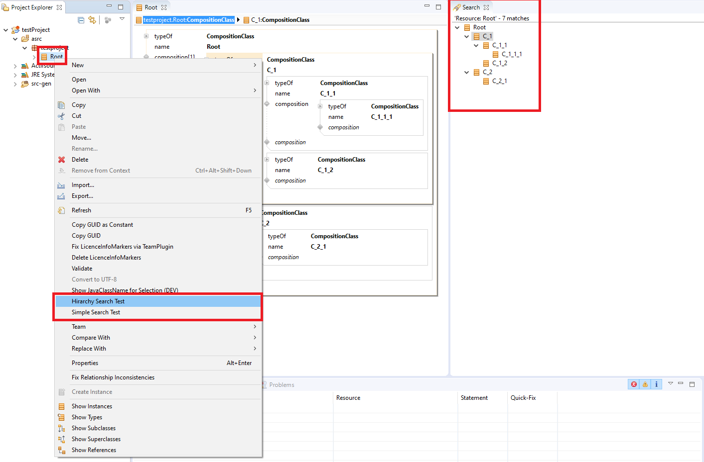

# ch.actifsource.example.searchstrategyaspect
In this project we will show how to use a user defined search plugin.
This plugin-project has to be executed inside the eclipse runtime environment.  




Aspect Implementation:

```java

public class SimpleSearchStrategyAspect extends DefaultSearchStrategyAspect {
  
  @Override
  public ISearchQueryStrategy createSearchQueryStrategy(IReadJobExecutor executor, IActifsourceSearchQuery query) {
    return new DefaultAspectQuery() {
      
      @Override
      public IStatus executeQuery(IReadJobExecutor executor, IProgressMonitor monitor, IActifsourceSearchQuery query, String taskName) {
        INode resource = SelectSearchUtil.getResourceFromQueryData(query);
        if (resource == null)  return Status.CANCEL_STATUS;
               
        List<AsMatch> matchResults = new ArrayList<AsMatch>();
        IStatementSet childs = Select.statementsForRelation(executor, GenericPackage.CompositionClass_composition, resource);
        for (Statement child: childs) {
        	AsMatch match = new AsMatch(child);    
            match.setAssignmentGroup(SelectSearchUtil.getFirstNamedResourceInsideStatementPath(executor, child.getPackage(), child.subject()));
            matchResults.add(match);
        }
        
        query.getSearchResult().addMatches(matchResults);
        return Status.OK_STATUS;
      }
    };
  }
}
```

## Requirements
Actifsource  Workbench Community Edition

## License
[http://www.actifsource.com/company/license](http://www.actifsource.com/company/license)

